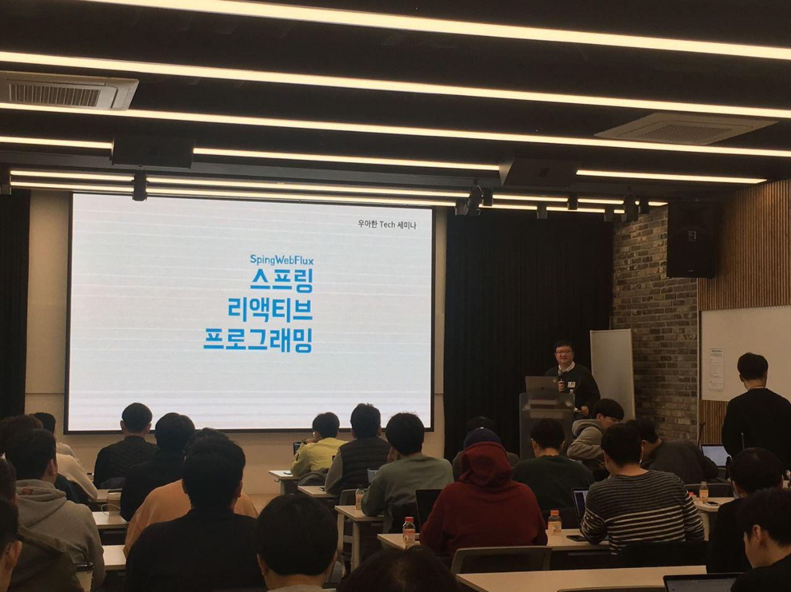
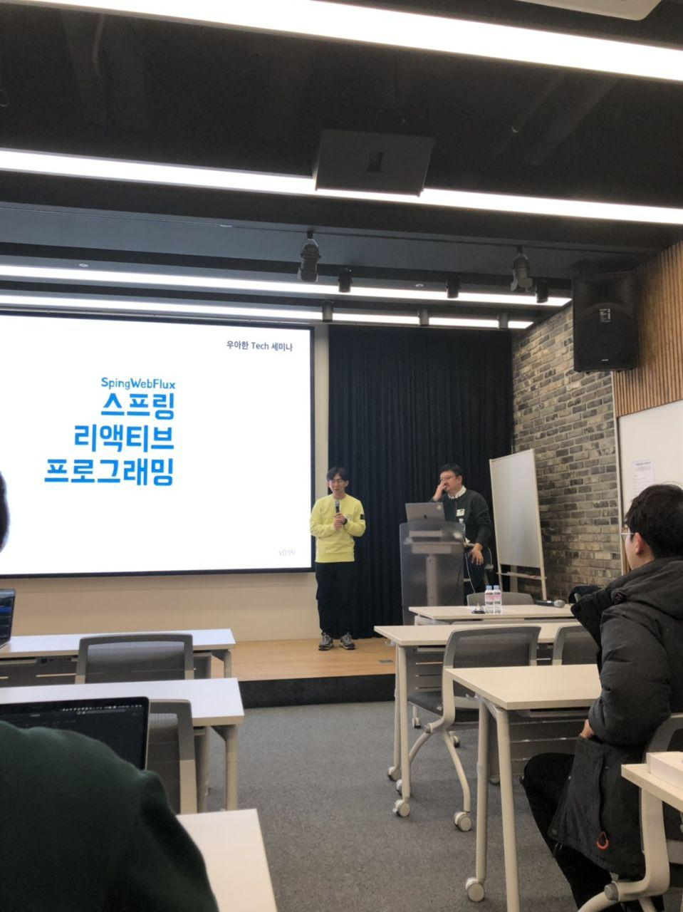
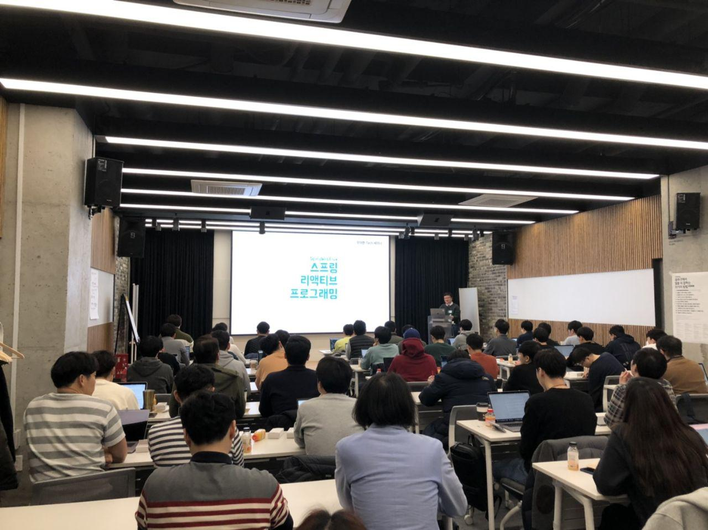

# 2019.03.13 - 토비님의 스프링 리액티브 프로그래밍

2019년 3월 13일 수요일에 사내에서 진행된 토비님의 스프링 리액티브 프로그래밍 세미나에 다녀왔습니다.


(우아한 테크톡 포스터)  
  
오늘 발표는 아무래도 리액티브 혹은 리액터에 대해 알고 계신 분들이라면 재밌게 들을 수 있지만, 처음인 분들께는 조금 공감하기 어려운 내용들이 될수 있습니다.  
  
그래서 읽으시기전에 [카카오 기술 블로그](http://tech.kakao.com/2018/05/29/reactor-programming/)를 참고하시면 더욱 도움이 됩니다.  
  
저는 토비님의 리액티브 발표를 3번째 듣고 있는데요.  
(카카오 컨퍼런스, 스프링 캠프, 이번 우아한테크톡)  
  
각 발표마다 대 주제는 비슷하지만 (리액티브와 웹플럭스) 상세 주제가 달라 3개 발표를 모두 들어보시는걸 추천합니다.

* 스프링캠프
    * [스프링5 웹 플럭스 소개](https://www.youtube.com/watch?v=2E_1yb8iLKk)
* if카카오 컨퍼런스
    * [스프링5 웹플럭스와 테스트전략](https://tv.kakao.com/channel/3150758/cliplink/391418995)

## 1. 발표시작전

7시 30분 부터 시작인데 6시 30분부터 많은 분들이 이미 와계셨습니다.



그래서 토비님과 미리 오신분들과의 티타임을 가졌습니다.  
이야기 중, 사내의 개발자분께 토비님께서 **직접** 질문을 드렸는데요.  
"**그 팀에서는 이미 Spring Web Flux를 쓰지 않나요?**" 였습니다.  
  
> 이미 두분이서 서로 아시는것 같았어요!
  
그렇게 해서 저희 회사 (우아한 형제들)의 소속 개발자이신 용근님이 앞에 나와 **Web Flux 사용 경험**에 대해 소개를 하게 되었습니다.



* 우아한 형제들 프론트 서버 개발팀의 [권용근](https://blog.kingbbode.com/posts/who-am-i-3?fbclid=IwAR3leDwiq7W7qxN3MxmC447a7tsFLz-Xk4Xv9dFlPNHnl7THbz5m9NaPBOQ)
* 현재 우아한 형제들의 몇몇 시스템은 리액티브 시스템으로 전환 중
    * 아무래도 여러 API를 취합해서 전달해야하는 시스템에서는 **각 API들의 경과 시간 전체 합산 시간**만큼 필요합니다.
    * 반대록 리액티브로 진행할 경우 여러 API 중 **가장 긴 경과 시간이 전체 시간**
    * 코드 가독성이 아무래도 쓰레드 모델보다는 훨씬 읽기 힘들다는 단점이 존재

용근님의 Spring Web Flux 경험담 이야기가 끝나고 나서 토비님께 질문하는 시간을 잠깐 가졌습니다.  
  
그 중 개인적으로 가장 와닿았던 질문에 대해 남깁니다.  
  
**Q. NodeJS (Promise / Async / Await)가 있는데 굳이 스프링 리액티브를 써야하는지?**

* 질문대로 **Spring을 Node처럼** 쓰고자 등장
* 이미 검증된 버츄얼머신 (JVM) 을 쓰고, 방대한 생태계를 그래도 사용하면서 비동기/논블로킹 프로그래밍을 하고자 하는 의도
  * 사실 비동기 서블릿이 나온건 2009년
  * 실제로 Node보다는 빨리 등장
  * 단, **사람들이 관심이 없었음**
* 비슷하게 스프링부트 역시 RoR (루비온레일즈)처럼 쓰고자 등장
* Node를 제외하면 사실 대부분의 프로그래밍에서는 UI 시스템에서 비동기/논블로킹을 사용
* 서버사이드에서 이를 해결하기 위해 RxJava를 많이 사용하게 됨
* 실제로 Java -> Node로 전환했다는 이야기보다는 Node -> Java로 전환했다는 이야기가 훨씬 많음

## 2. 발표

신청자 분들이 모두 오신 뒤 드디어 발표가 시작됩니다!



**주제**

* 스프링 리액티브 프로그래밍이란 무엇인가
* 스프링 리액티브 프로그래밍이 어디에 필요한가
* 스프링 리액티브 프로그래밍은 어떻게 하는가

> **발표 내용이 어렵다면 그건 제가 여러분을 존중하기 때문입니다.** - 모 대학 교수님

### 리액티브 프로그래밍

* 리액티브?
  * 이벤트에 반응해서 동작
    * 버튼을 누르면 기능이 동작하는 것 처럼
  * main()으로 시작해서 정해진 작업을 수행하고 종료하는 방식을 **제외한** 요즘 모든 앱은 리액티브
  * 리액티브 프로그래밍은 어디에나 있는 아주 흔한 것이다.

> 코세라에서 마틴 오더스키 교수님의 Principles of Reactive Programming 과정중 소개

그렇다면 스프링 개발자라면 이미 리액티브 프로그래밍을 하고 있는 중인가?

* ReactiveX 창시자가 설명하는 리액티브
    * 에릭 마이어
    * Rx Framework를 개발
    * 리액티브 선언서
      * 리액티브 시스템이라면 (리액티브 프로그래밍은 아님)
        * Responseive
        * Resilient
        * Elastic
        * Message Driven
    * 위에서 소개한 마틴 오더스키 강의에서도 위 4가지 개념에 대해 이야기함
    * Reactive는 과용 되는 단어이다. 질문하는 사람이 누군가에 따라 각기 다른 답변이 가능하다 - 유겔 할러
* 스프링 개발자가 말하는 리액티브 프로그래밍
    * 인프라 스트럭처에 대한 도전이다
      * 인프라 스트럭처의 **리소스를 효율적으로 운용**하기 위해
    * 프로그래밍 모델의 전환
      * **보이지 않는** 리소스 문제를 해결하기 위해 **보이는** 코드 작성 방식을 바꿔야 한다
    * 가용성과 응답성을 향상시켜 효율성과 성능을 얻는것
    * 간단히 말해서 리액티브 프로그래밍은 **생성자가 소비자를 압도하지 못하게 하는 목적**이 핵심인 배압을 가지고 작은 수의 쓰레드로 확장성이 있는 논블로킹/ 이벤트 드리븐 개발
* 함수형 프로그래밍
  * 리액티브 프로그래밍은 함수형 프로그래밍을 기반으로 한다

### 스프링 5와 리액티브 프로그래밍

* 스프링5 이상이 필요
* 오랫동안 자바 개발자들에게 동시성이란 '**많은 쓰레드를**' 의미
* 새로운 도전
  * 시스템이 **분산**됨에 따라 API 호출, 데이터 엑세스, 서비스 이용등으로 IO 수행시간이 대폭 증가
  * IO 작업 수행중 쓰레드 점유
* 쓰레드 풀의 딜레마
    * CPU, 메모리가 충분하지만 **쓰레드가 모자라서** 처리율 저하
    * 그래서 쓰레드를 과도하게 늘리면 이번엔 **메모리, CPU에 부하**로 성능 저하
    * 컨텍스트 스위칭이라 하여 CPU간 전환 과정은 엄청난 부하가 필요
    * 즉, **쓰레드를 무조건 늘린다고 문제를 해결할 수 있는 것은 아님**
* 리소스의 효율적인 사용을 위해서
  * 쓰레드, CPU, 메모리, 네트워크 등을 최대한 효율적으로 활용
  * 새로운 프로그래밍 모델
    * 비동기 로직 구성
    * 논블로킹 IO
* 비동기
    * 작업 요청하는 시점과 결과를 받아 처리하는 시점의 불일치
      * 결과 데이터를 받으면 처리한다
      * 그때까지는 **다른 작업을 하거나 리소스를 반납한다**
    * 비동기작업의 결과를 처리할 로직을 담은 콜백을 이용
      * 비동기 작업의 결과를 **콜백**에 전달
      * 즉, 결과를 담는 것이 아니라 **함수**를 담음
      * Continuation-style API 이용
    * 비동기 작업을 별도의 쓰레드에서 수행
      * 콜백을 사용하는 동기 요청처리도 있음
      * 스프링의 template/callback, Stream
* 논블로킹 IO
    * IO 작업을 수행하는 동안 쓰레드를 점유하지 않음
    * 동시에 많은 IO 작업을 처리할 수 있음
    * Java의 NIO 패키지 코드를 참고
    * 영상 참고
* 비동기 == 논블로킹?
    * 자세한 설명은 예전에 소개한 영상을 참고할것
    * [2017 스프링캠프](https://www.youtube.com/watch?v=HKlUvCv9hvA) 에서 9:45 ~ 11:47 참고

## 3. 데모

데모는 1초간 Lock을 잡는 API를 각각의 방식으로 호출하여 비교

* 전통적인 방식의 API 호출 (Sync/Blocking)
    * API를 두번 호출
    * 총 2초가 걸림 (1초 + 1초)
* 비동기 + 동시 요청 (즉 서로 의존하지 않는 호출)
  * ForkJoinPool로 비동기 호출
  * 각각의 쓰레드에서 호출되는 것 확인
  * 총 1초정도 수행됨
  * 하지만 쓰레드 2개를 소모
* 비동기 + 순서보장
  * 비동기 요청이지만 순서 보장 가능
  * **시간 이점은 전혀 없음**
  * **콜백헬**이 발생 (Node 콜백과 같음)
* 비동기 + CompleteableFuture (Promise)
  * 코드가 쓰레드 모델과 유사하여 가독성이 좋음
  * 코드의 순서와 **실행 결과가 일치하지 않음**
    * 결국은 콜백 구조
* 왜 이렇게 코드를 다 작성해야하지? 라는 의문 시작
* Async / Await + Blocking
    * 코드만 보면 쓰레드 모델처럼 보임
    * 비동기로 코드가 처리
    * 콜백 코드를 **컴파일러가 해결**
* Blocking하는 RestTemplate이 아닌 **NonBlocking**이 지원되는 다른걸 사용해보자
  * 결과는 1초
  * 그럼 Blocking과 같은거 아닌가? - 차이점은?
    * **같은 쓰레드로 처리**
* 스프링 웹플럭스로 진행하는 테스트
    * 10, 100개 API 호출 (개당 1초)
    * 전체 수행시간은 1초 (NonBlocking으로 동시에 진행)  
    * 쓰레드는 모두 동일한 쓰레드 사용
* 리소스를 효율적으로 사용하려면
  * 논블로킹 IO 필수
    * IO 작업에는 **최소한의 쓰레드**로도 충분
    * 로직을처리하는 코드는 잛은 시간에 수행
  * 비동기 프로그래밍 모델 사용
  * 스프링 리액티브 프로그래밍은 여기에 백프레셔와 스트리밍 개념을 추가

## 4. Reactive Streams와 Reactor

* 넘어야 할 높은 산
* Reactive Streams
    * 논블로킹 백프레셔를 이용한 비동기 데이터 스트림 처리 표준
      * JKD9 Flow API로 채택
      * AkkaStreams, MongoDB, RxJava, Slick, ES, Kafka, Project Reactor
    * **비동기 논블록킹 + 데이터 스트리밍 + 백프레셔**
    * 표준 스펙 (JVM)
      * 구현 기술간의 상호 전환 가능
* Reactive Streams 스펙!
  * **정말 중요함**, 꼭 기억해야함
  * Publisher는 Subscriber의 요청에 따라 제한 없는 일련의 데이터를 제공
    * 계속해서 신호를 보내는 역할
  * Subscriper는 신호를 **구독**
  * 둘의 관계는 ```publisher.subscribe(Subscriber)```로 연결 - 즉 시작
  * ```onSubscribe```, ```onNext```, ```onError```, ```onComplete``` - ```onError`는 실패할때 ,onEompele는 성공할때 
    * ```onSubscribe```는 항상
    * Subscriber요청에 따라 0 ~ N개의 onNext
    * ```onError``` 혹은 ```onComplete```를 마직으로 종료

> 토비님의 유튜브 [리액티브 프로그래밍](https://www.youtube.com/watch?v=8fenTR3KOJo) 참고

* Reactor
  * 스프링 리액티브 개발에 사용되는 대표 Reactive Streams 구현
  * 두개의 Publisher
    * Mono (0..1) - void, T
    * Flux (0..N) - Iterable<T>
    * 데이터 스트림을 다루는 방대한 연산자
      * 진행 과정 중간중간 변경 연산을 진행하는 작업자
    * 다양한 스케줄러
  * 조합성과 가독성
* Mono와 Flux중 어떤것을 쓸까?
  * **Mono부터 마스터**
* * Publisher가 전달하는 데이터, 시그널을 가공, 변환해서 새로운 Publisher를 만드는 도구
* Java8의 Stream의 map()과 filter 비슷한 개념
    * Publisher가 scribe하지않으면 발생하지 않음
    * ```map```
        * 데이터를 변환하는 **동기적인** 방법
    * ```flatMap```
        * 데이터를 변환하는 **비동기적인** 방법
* 디버깅
    * 비동기 코드는 디버깅이 어려움
    * 체인 실행중에 예외가 나면 디버거를 걸어봐야 조립 시점이거나 실행 시점에서는 onNext()의 연속
    * **Reactor에서 제공하는 디버그 모드 이용**
    * 로그인용
    * Mok 사용시 체인이 끊기지 않도록 주의

## 5. 스프링 리액티브 

**스프링 리액티브를 쓰지 말아야하는 이유**

* 스프링 개발자가 아니라면
* 스프링 MVC로 개발해서 별 문제 없이 잘 돌아간다면
* 블로킹 IO 작업이 있다면
* 블로킹이 뭔지는 모르겠으나 **JPA, JDBC, MyBatis**를 쓰고 있다면
* 리모트 서비스, API 호출이 전혀 없고, NoSQL도 사용하지 않고, 메세징 서비스 등을 사용하지 않는다면
* 개발팀이 크고 새롭고 도전적인 기술 학습과 시행 착오에 대한 **부담이 있다면**

**스프링 리액티브 개발을 시작할때 기억할 것**

* 비동기-논블로킹 서비스를 만드는 것이 목적
* Publisher, Subscriber를 직접 만드는 경우는 거의 없다
* ```scribe()```는 스프링 MVC, WebFlux가 담당
* 비동기 - 논블로킹 Publihs 생성은 Reactor 라이브러리가 담당

**스프링 리액티브 프로그래밍 모델 선택**

* @MVC 어노테이션 - 서블릿 스택, 리액티브 스택
* 함수형 엔드 포인트 - 리액티브 스택
    * 아직 미성숙 단계

**스프링 MVC 코드를 리액티브로 전환**

* 컨트롤러의 리턴 타입을 T -> Mono<T>로
* 서비스 인터페이스 메소드릐 리턴 타입도 Mono<T>
* 데이터를 직접 생성한다면 Mono.just()
* **동기 함수 호출**은 ```map```으로
* RestTemplate -> WebClient
* 리액티브 지원 저장소는 MonoDB, Redis, Cassandra, Couchbase 호출
* 코드는 SpringData -> Reactive 버전으로
  * 전달할 값이 없어도 ```then -> Mono<Void>```로 **반드시 연결**
  * **체인이 끊기면 실행되지 않음**
* 체인이 시작된 후로 **비동기 작업`**이 필요한 경우엔 ```flatMap()```
* 예외 -> onErrorXX
* Controller에서 던지는 ```Flux<Order>```와 ```Mono<List<Order>>``` 는 **클라이언트 입장에서는 결과가 같음**

## 6. 데모2

* 실습은 리액티브를 지원하는 MongoDB 사용
* ```produces = MediaType.TEXT_EVENT_STREAM_VALUE``` 선언시 **백프레셔** 사용 가능
* WebClient
    * 비동기 논블로킹 리액티브 API 호출
    * **이후 체이닝이 필요**
* JPA/JDBC
    * 비동기에 적합하진 않음
    * 별도의 블로킹 작업만 담당하는 쓰레드풀이용
    * 트랜잭션은 **각 블로킹안에서만**
    * 웬만하면 **블로킹 작업을 먼저하고**, 리액티브 체인을 시작한다
        * 반대로하면 너무나 꼬임
    * ADBA (Asynchronous Database Access API)
        * 아직 성숙하지 못함
    * R2DBC
        * 오픈소스 리액티브 DB API 표준
        * H2, PosgreSQL, MS SQL Server

## 7. 마무리

리액티브는 과연 필요한가?

* 꼭 그렇지는 않음
* 하지만 **기술 생태계는 리액티브를 좋아하고 적극 지원**
* 새로운 프로그래밍 모델에 도전
    * 이제 쓰레드 모델의 어노테이션 기반 스프링 지겹지 않나요!? (라고 하심)
* 적합한 곳에 잘 사용한다면 좋은 효과 보장
    * 포털이나 커머스등의 프론트 (메인 페이지) 등에서 사용하기 좋음
* 어렵지만 재미있음
