# 우아한 객체지향 - 2019년 6월 우아한 Tech 세미나

우아한형제들의 Tech 세미나 6월 주제! 우아한 객체지향에 다녀왔습니다.  

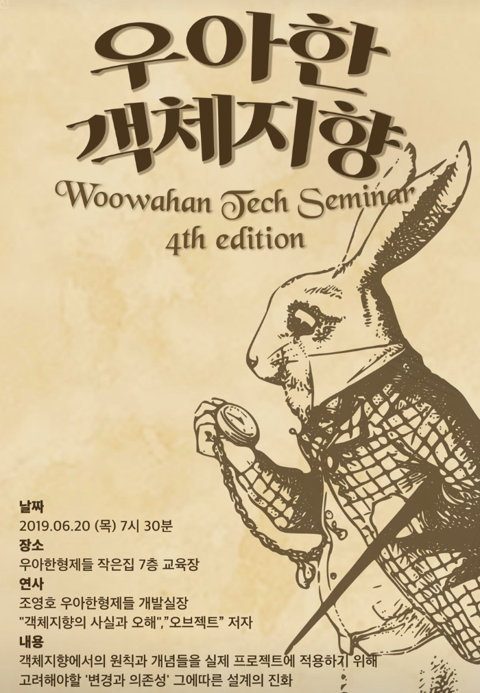

부제: **의존성을 이용해 설계 진화시키기**  
  
이미 발표자이신 조영호님께서 발표자료를 공유하신 상태라서 아래 자료들과 함께 후기를 보시면 더욱 도움이 될것 같습니다.

* [발표자료](https://www.slideshare.net/baejjae93/ss-150432699)

* [코드](https://github.com/eternity-oop)
  * [1단계](https://github.com/eternity-oop/Woowahan-OO-01-object-reference)
  * [2단계](https://github.com/eternity-oop/Woowahan-OO-02-object-reference)
  * [3단계](https://github.com/eternity-oop/Woowahan-OO-03-object-reference)

후기에 들어가기 앞서, 소감을 말씀드리면.  
  
혹시나 다음에 또 **같은 주제로 발표가 이루어진다면 꼭 들어보세요**.  
  
그동안 말로 설명하지 못하고 모호하고 막연하게 생각하고 이야기했던 것들을 명확하게 정리할 수 있었던 시간이였습니다.  
  
너무 내용이 좋아서 듣는내내 기분이 좋고 흥분되었습니다.  
주변의 많은 분들이 들었으면 좋겠다는 생각이 들어서 발표 장표를 다시 돌아보며 하나하나 후기를 작성했습니다.  
  
너무 좋은 내용이였으니 나중에 볼 기회가 있으신 분들은 꼭 보시길 추천합니다.

## 0. 들어가며

오늘 발표할 내용은 딱 2가지

* 어떻게 의존성을 관리하는게 좋은 의존성인지
* 의존성을 어떻게 관리하는지에 따라서 설계가 어떻게 변경되는지

## 1. 의존성이란?

* 설계란 무엇인지를 물어보면 다양한 의견이 나옴
  * 생각하기에 설계란 **코드를 어떻게 배치할 것인지**
  * 어떤 패키지에, 어떤 프로젝트에, 어떤 클래스에 어떤 코드를 넣을지
* 변경에 초점을 맞추는게 중요
* 변경이란?
  * B가 변경할때 A도 변경된다
* 클래스 의존성의 종류
  * 연관 관계
  * 의존 관계
  * 상속 관계 (extends)
  * 실체화 관계 (implements)
* 패키지 의존성
  * 패키지에 포함된 **클래스 사이의 의존성**

**좋은 의존성 관리를 위한 규칙들**

1. **양방향 의존성을 피하라**

문제

```java
class A {
  private B b;

  public void setA (B b) {
    this.b = b;
    this.b.setA(this);
  }
}

class B {
  private A a;

  public void setA(A a){
    this.a = a;
  }
}
```

* A<->B 
* B가 바뀔때 A도 바뀌는데, A가 바뀌면 B도 바뀐다
* 사실 이런 상태면 이건 **하나의 클래스로 두어야하는걸 억지로 찢어낸격**
* 가급적이면 아래와 같이 **단방향**으로 구현하라

해결책

```java
class A {
  private B b;

  public void setA (B b) {
    this.b = b;
  }
}

class B {
}
```


2. **다중성이 적은 방향을 선택하라**

문제

```java
class A {
  private Collections<B> bs;
}

class B {
}
```

* 일대다 보다는 다대일로 구현하라
* A가 Collection B 를 갖기 보다는 **B가 A를 참조**하는걸 권장

해결책

```java
class A {
}

class B {
  private A a;
}
```

3. **의존성이 필요없다면 제거하라**

4. **패키지 사이의 의존성 사이클을 제거하라**

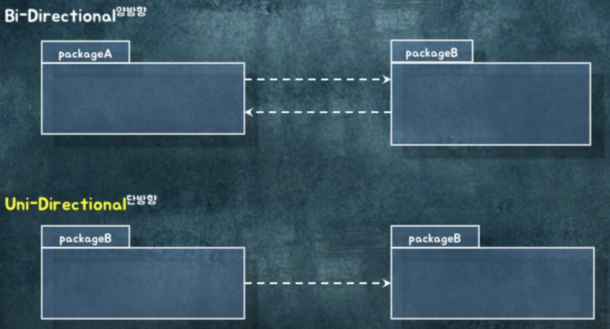

* 패키지 간에도 단방향으로

5. **자주 바뀌는 영역이 덜 자주 바뀌는 영역을 의존하게 둔다**
    * 메타적인 성격 (메뉴, 가게 등)의 도메인과 오퍼레이션 성격 (주문 등)의 도메인이 존재
    * 의존성은 오퍼레이션 영역이 메타 영역의 도메인을 의존하게 둔다

## 2. 예제 살펴보기

* 세미나를 위해 단순화시킨 코드를 만들었음
* 주문 플로우
  * 가게 선택
  * 메뉴 선택
  * 장바구니 담기
  * 주문 완료

### 2-1. 도메인 컨셉

**가게 & 메뉴**

* 가게 - 메뉴 - 옵션그룹 - 옵션

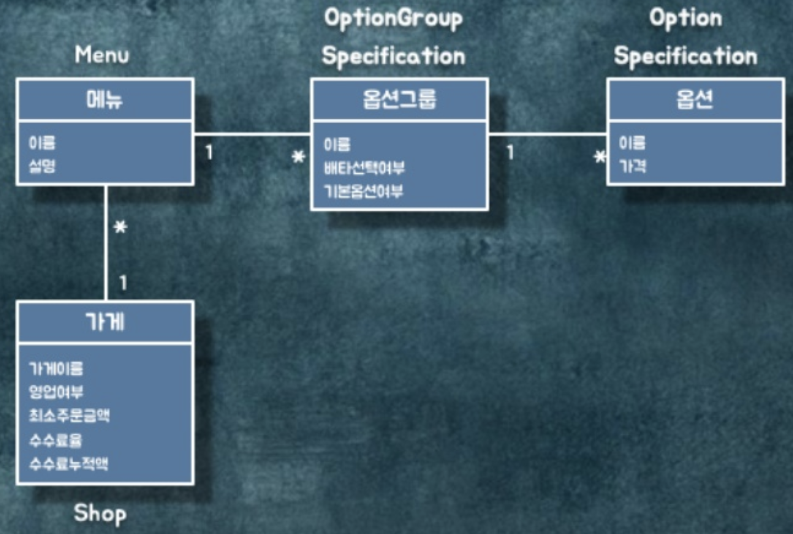

런타임에선 다음과 같이 작동

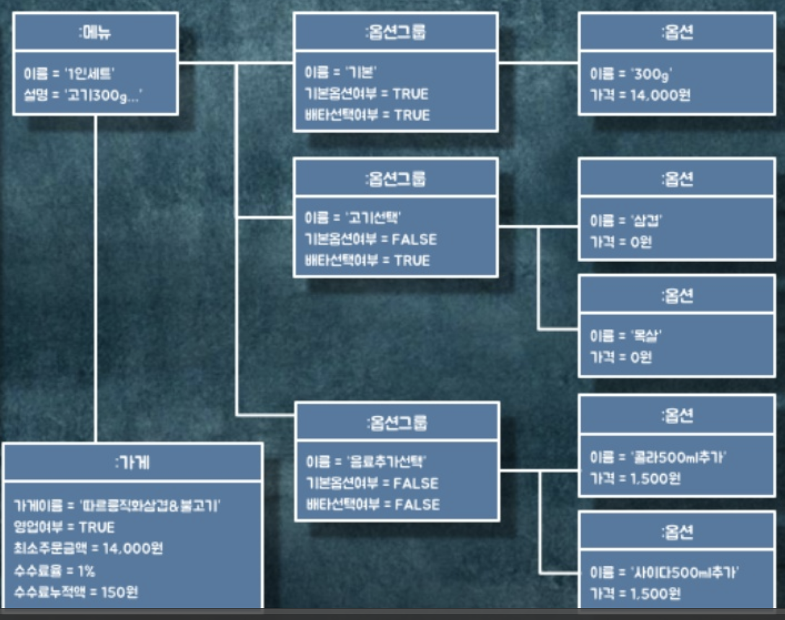

**주문**

* 주문 - 주문항목 - 주문옵션그룹 - 주문옵션

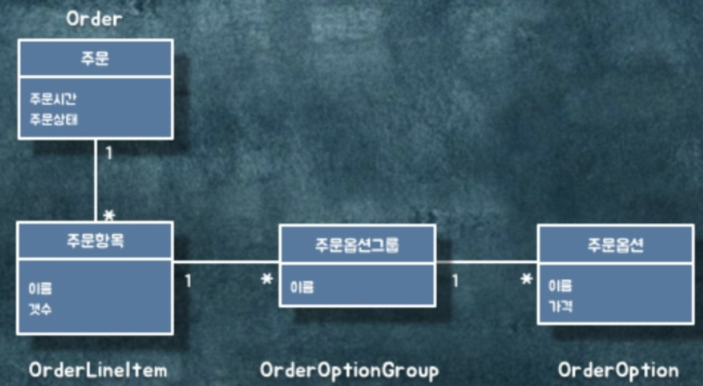

런타임에선 다음과 같이 작동

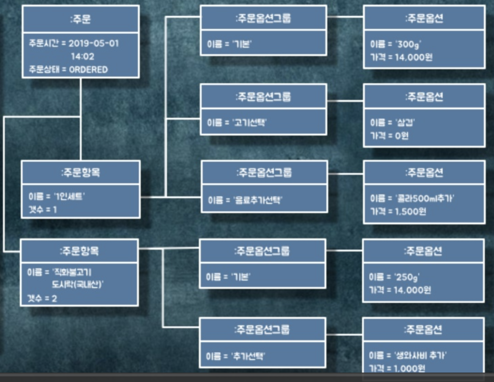

메뉴 & 주문 런타임 구동 플로우

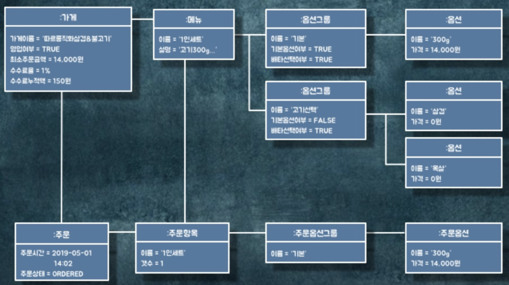

### 2-2. 문제점

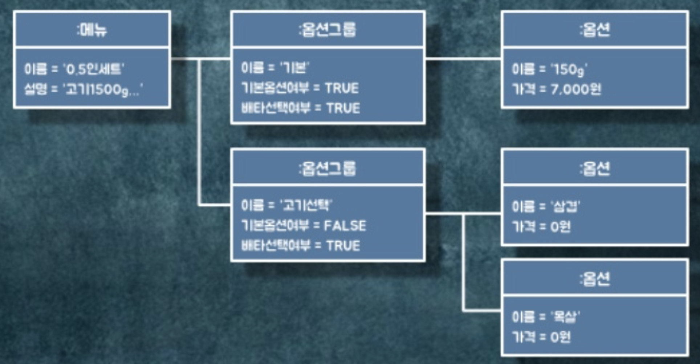

* 메뉴선택
  * 손님이 장바구니에 **1인 세트**를 선택한 상태
    * 이때 서버 부하를 감소하기 위해 **앱 로컬 저장소에만 저장** 된 상태
    * 서버에 저장하진 않은 상태
  * 이때 만약 **사장님이 1인 세트 메뉴를 변경하면**?
    * 메뉴가 불일치 하는 문제가 발생
* 문제를 해결해보자!
* 주문 검증
  * **메뉴의 이름**과 주문 항목의 이름 비교
  * **옵션 그룹**의 이름과 주문 옵션 그룹의 이름 비교
  * **옵션의 이름**과 주문 옵션의 이름 비교
  * **옵션의 가격**과 주문 옵션의 가격 비교
  * 가게가 영업중인지
  * 최소주문금액 이상인지

**협력 설계하기**

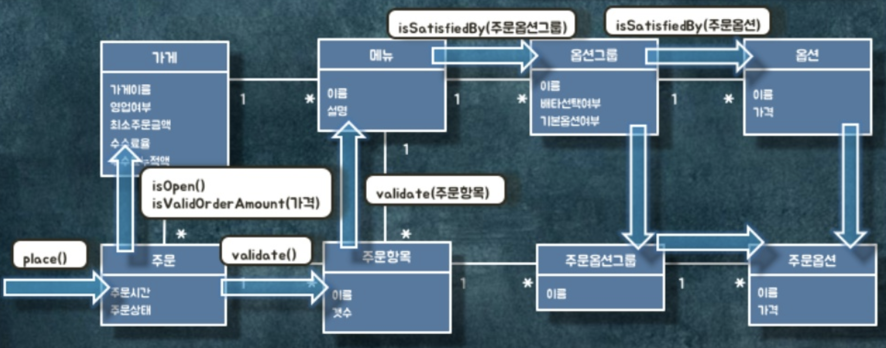

* 주문 요청이 옴 (사장님께 주문 왔다는 알람을 주기전)
  * 가게가 영업중인지 확인
  * 주문 금액이 최소 주문 금액 이상인지 확인
  * 메뉴의 이름과 주문 항목의 이름 비교
  * 메뉴의 이름과 주문 항목의 이름 비교
  * 옵션 그룹의 이름과 주문 옵션 그룹의 이름 비교
  * 옵션의 이름과 가격을 주문 옵션의 이름과 가격 비교

이 플로우를 지지고 볶아보자

[[ad]]

* 협력이라는 것을 **코드로 표현**이 필요하다
* 관계에는 방향성이 필요
  * 의존성의 방향 == 협력의 방향
* 관계의 종류 결정하기
  * 연관 관계
    * A 객체 -> B 객체로 요청이 한번 혹은 몇번 발생하는건 연관관계로 맺을 필요가 없음
      * 근데 이 요청이 빈번하다면 이들 사이에 **연관관계**를 맺는게 필요
    * 협력을 위해 필요한 **영구적인** 탐색 구조
  * 의존 관계
    * 협력을 위해 **일시적으로** 필요한 의존성
      * 파라미터, 리턴타입, 자연변수
  * 내가 어떤걸 참조할때는 **이유가 있어야 한다**
    * 런타임에서 객체들이 어떻게 협력하는지에 달려있다.

**연관관계 == 탐색 가능성**

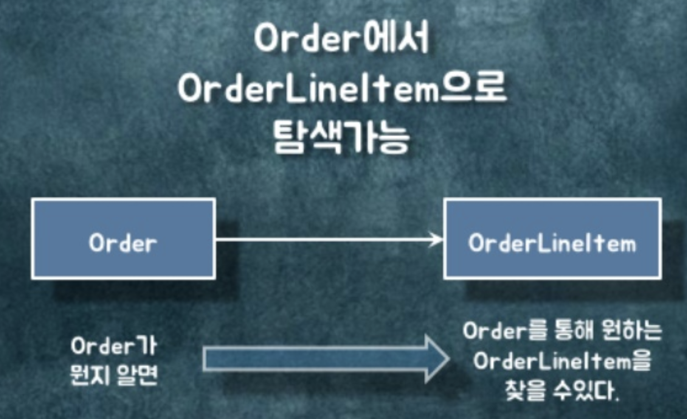

* Order에서 OrderLineItem으로 탐색 가능
* 어떤 객체가 있는데 **이 객체를 알면 내가 원하는 다른 객체를 찾을 수 있어** 의미
* 두 객체 사이에 협력이 필요하고 영구적 관계라면 연관관계 필요
* **객체 참조**를 이용한 연관관계 구현

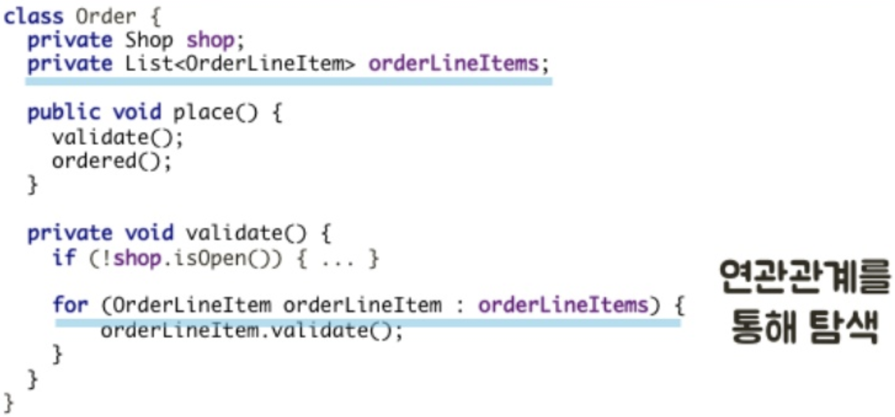

* 멤버 변수로 사용
* 연관관계는 개념으로, 객체 참조는 구현단계임
  * 둘을 1:1 매핑하는게 필수가 아님

### 2-3. 구현하기

Order 엔티티

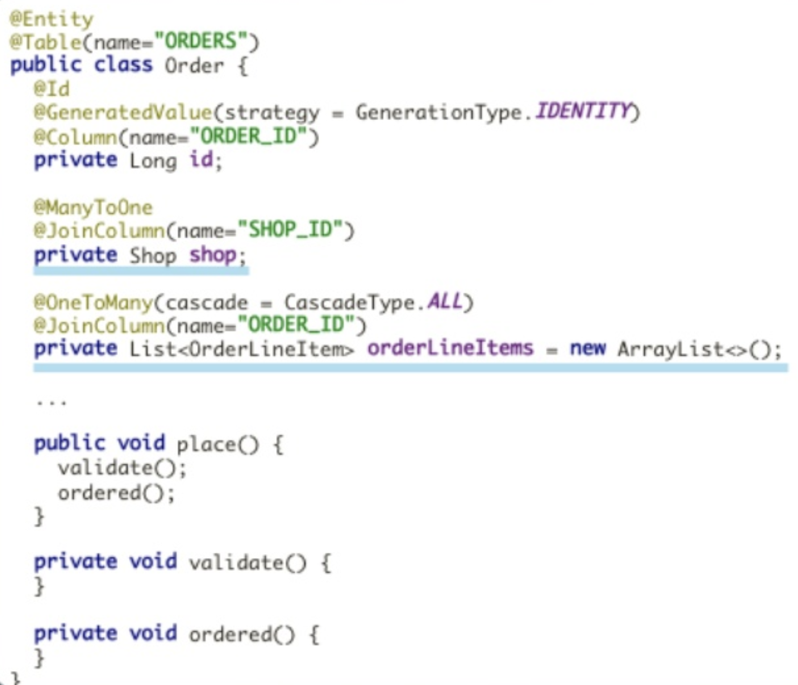

* Order 엔티티에 Shop, OrderLineItem 연관관계 연결

여기서 Shop, OrderLineItem의 검증 로직 (validate()) 도 구현하게 되면 아래의 로직이 추가

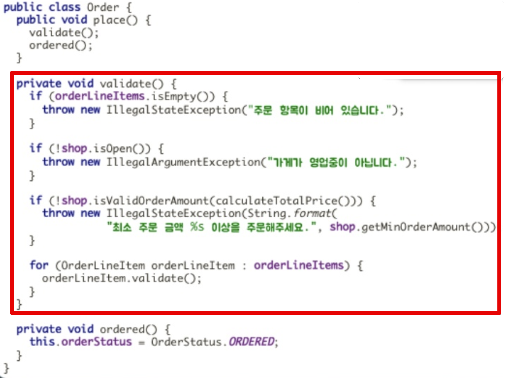

* 객체가 협력 상태
* 레이어 아키텍처 중에서 **Domain** 영역에 해당
 
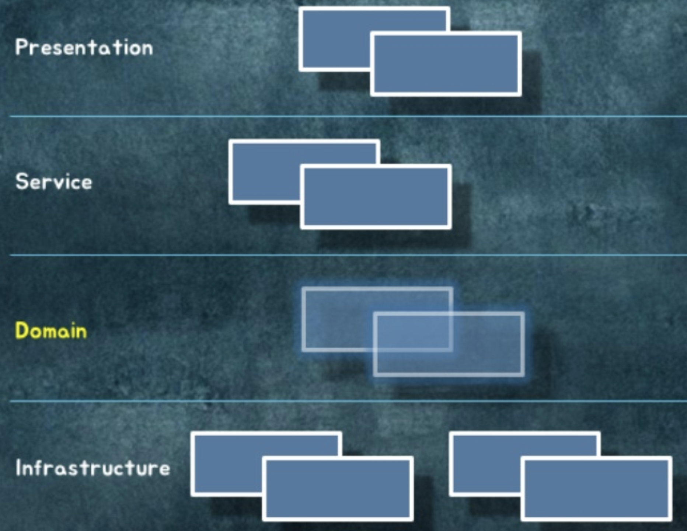

## 3. 설계 개선하기

* 많은 분들이 설계를 어떻게 개선해야하냐 라고 물어봄
  * 클래스를 일단 만들고 의존성을 종이에 그려보시라
  * 패키지를 잘못나눴나, 클래스를 잘못나눴나 등
* 오늘은 딱 2가지 문제만 소개
  * **객체 참조로 인한 문제점**
  * **패키지 사이클로 인한 문제점**
* 무엇인 문제인가?
  * Shop과 Order 사이에 **의존성 사이클** 발생

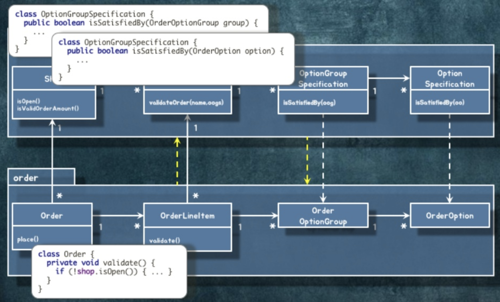

### 3-1. 해결 방법

1. 중간 객체를 이용한 의존성 사이클 끊기

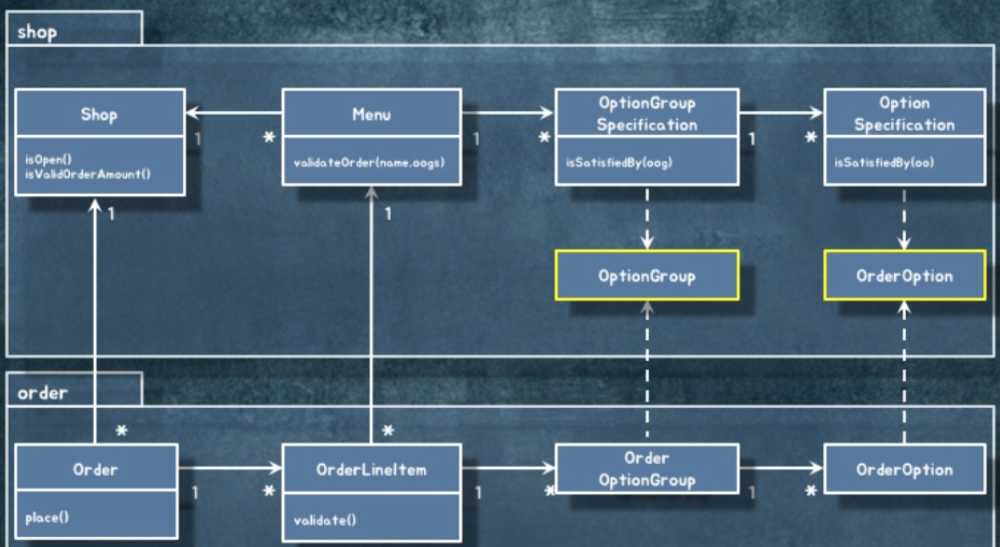

* OrderOptionGroup <-> OptionGroupSpecification 양뱡향을 끊어냄
  * Specification: 다른 객체의 정합성을 맞추는 역할
      * isXXX 메소드가 너무 많이 한 객체에 몰려있으면 이런 패턴으로 분리함
* OrderOptionGroup -> OptionGroup <- OptionGroupSpecification 로 **단방향으로 흐르게 개선**
  * 추상화라고 하면 꼭 추상클래스나 인터페이스를 얘기하지 않음
    * 개발에서 추상화란 **잘 변하지 않는 것**을 얘기함
 
### 3-2. 객체 참조로 구현한 연관관계의 문제점

* 성능 문제
  * 어디까지 조회할 것인가
  * 객체가 다 연결되어 있는 상태
  * 메모리 상에선 문제없지만, ORM, 데이터베이스를 통해야한다면 어떻게 해야할까?
    * 레이지 로딩이슈가 같은 문제
  * 객체 그룹의 조회 경계가 모호
    * 어디까지 읽어야하는지 기준도 없음
* 수정 시 도메인 규칙을 함께 적용할 경계는?
  * Order의 상태를 변경할때 연관된 도메인 규칙을 함께 적용해야하는 객체의 범위는?
  * 다른 말로 - **트랜잭션 경계는 어디까지로**?
    * 어떤 테이블에서 어떤 테이블까지 하나의 단위로 잠금 (Lock) 을 설정할 것인가?
      * 결국 데이터베이스와 같은 외부 저장소를 쓸때 객체 참조는 이를 신경쓰지 않는 경우가 많음

하지만 문제! - Shop, Order, Delivery **변경의 빈도가 다르다**

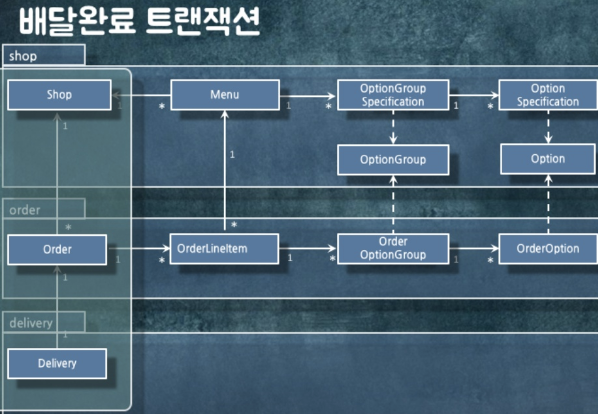

* 아무 생각 없이 객체를 쫓아가며 업데이트 하는 경우 **트랜잭션 경합으로 인한 성능 저하 문제**가 꼭 발생

여기서 드는 의문 - **객체 참조가 필요한가?**

* 객체 참조의 문제점
  * 모든 것이 연결되어 있다
  * 객체 참조는 결합도가 가장 높은 의존성
  * **필요한 경우에는 객체 참조를 끊자**
* 연관 관계와 탐색 가능성
  * Order를 알면 Shop을 탐색 가능한 현재 상태 - 강한 결합도


* 이를 해결하려면?
  * Repository를 통한 탐색 - 약한 결합도
  
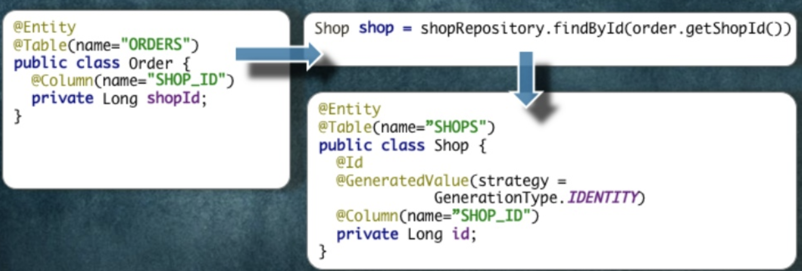

* Order에서 shopId만 가지고, Shop에선 Repository를 order.getShopId로 찾는다

**모든 객체참조는 불필요한가?**

* 어떤 객체들을 묶고 어떤 객체들을 분리할 것인가?
  * 함께 생성되고 함께 삭제되는 객체들을 함께 묶어라
    * 결국 비지니스
    * 비지니스 상에서 한 트랜잭션으로 묶어야 할 객체들
  * 도메인 제약 사항을 공유하는 객체들을 함께 묶어라
    * 얘가 바뀔때 얘가 변경안되도 되면 안 묶어도 됨
  * 가능하면 분리하자

**경계 안의 객체는 참조를 이용해 접근**

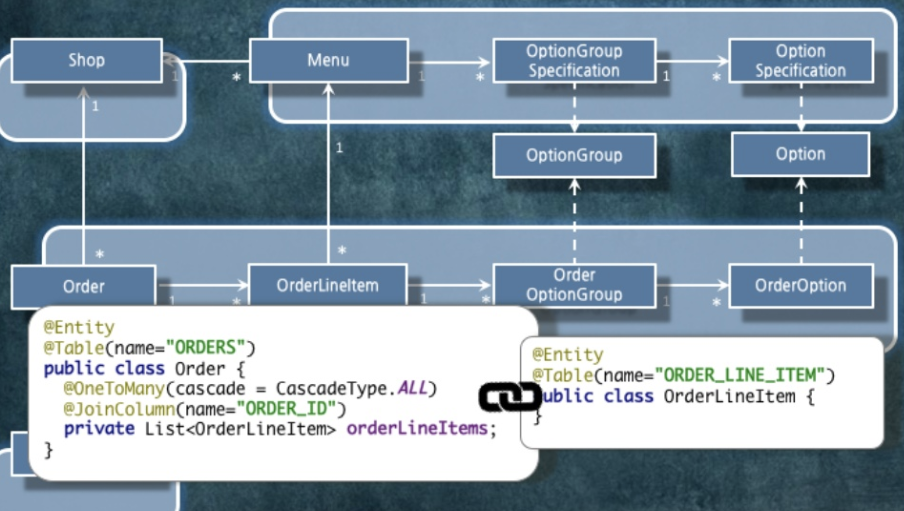

* 연관관계를 묶자
* 같이 읽어와야하고, cascade로 등록/삭제가 함께 움직여야 되기 때문

**경계 밖의 객체는 ID를 이용해 접근**


* 만약에 Order의 Shop을 탐색하고 싶다면 
  * ```shopRepository.findById(order.getShopId())``` 로 탐색하자
  * 무조건 Eager 혹은 Lazy를 쓰라는 얘기가 아니라 상황에 따라 쓸수있게 됨
  * 그룹 단위의 영속성 저장소 변경 가능
    * 객체참조가 아닌 id 기반이니 MongoDB와 같은 NoSQL로 변경 가능하게 됨
 
**하지만 객체 -> ID로 변경하면서 객체참조를 끊게 되면 여러 문제가 발생**

* Order-Shop간 컴파일 에러
  * **객체를 직접 참조하는 로직을 다른 객체로 옮기자**

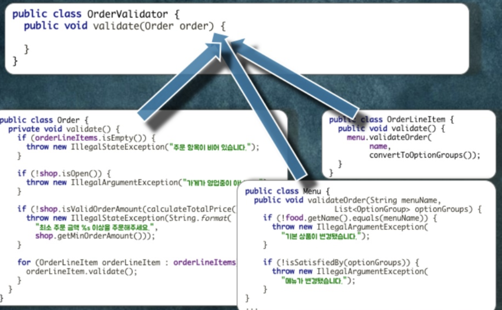

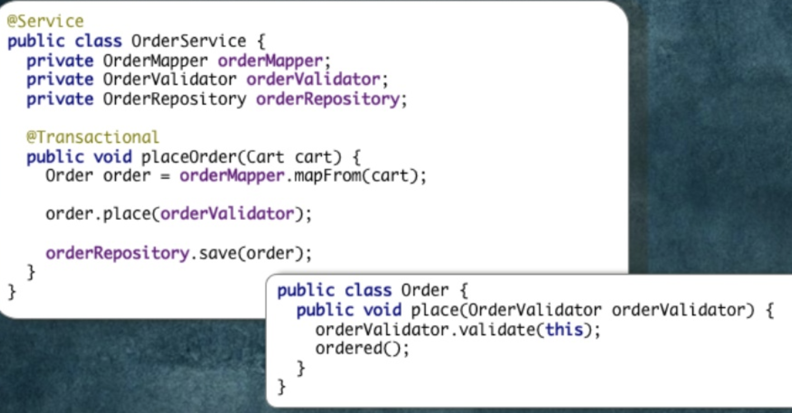

* Order의 Validation 로직을 담당하는 객체 (OrderValidator)를 생성
* 이로 인해 검증과 주문처리를 담당하는 **Order 객체가 주문처리만 담당**하게 되니 **높은 응집도**를 가진 객체가 됨
* 즉, 객체의 상태를 검증하기 위해 **여러 객체가 필요하다면 꼭 그 객체안에서 다 처리안해도 된다**
  * 검증용 객체를 만들어서 거기서 처리하는것도 좋은 방법이다.

* Order-Delivery 배달 완료 컴파일 에러
  * 본질 - 도메인 로직의 순차적 실행


* 어떤 객체가 변경되면 어떤 객체가 변경되야해요 라는 상황
* 2가지 해결 방법 가능
  * 첫번째 방법 (검증 객체)처럼 중간 객체에서 처리한다
    * 단 여기서 의존성 사이클 문제가 발생하면 **의존성 역전**으로 해결한다
    * 객체간의 의존성을 강하게 잡혀있지만, **로직을 한눈에 볼 수 있음**
  * 두번째 방법은 **도메인 이벤트 퍼블리싱**
    * 객체간의 관계를 느슨하게 하고 할 수 있음
    * Order의 상태가 변경됐을때 이벤트 핸들러가 해당 이벤트를 수신해서 처리
  * 두번째 방법도 단순히 이벤트 핸들러를 shop 패키지에 두게 되면 의존성 사이클이 발생함
  * 세번째 방법으로 이벤트 핸들러를 새로운 패키지로 찢어낸다
    * 결국 Shop과 Order 사이엔 패키지도 단방향, 클래스도 단방향으로 흐르게 되는 구조가 됨
* 패키지 의존성 분리 3가지 방법을 소개 했음
  * 새로운 객체로 변환
  * 의존성 역전
    * **Repository의 인터페이스는 도메인 영역**에 두고, 구현체 (Custom, Impl)는 인프라스트럭쳐 영역에 두어야 한다
    * Repository 인터페이스는 **도메인의 오퍼레이션**
  * 새로운 패키지 추가

## 4. 의존성과 시스템 분리

* 도메인 이벤트 **사용전**의 의존성
  * 패키지 의존성 문제 발생
* 도메인 이벤트 **사용후**의 의존성
  * 패키지 의존성 문제 없음

**도메인 단위 모듈화**

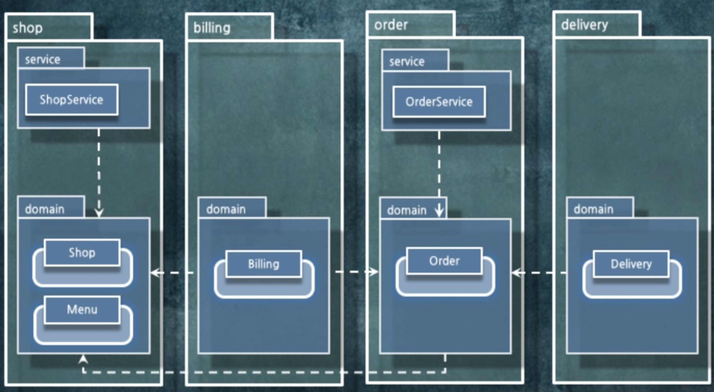

* 도메인 단위 모듈 == 시스템 분리의 기반
  * 도메인 단위로 시스템 분리 가능

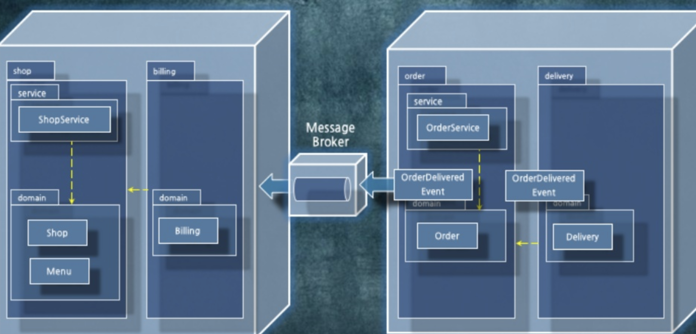

* 시스템 이벤트를 통한 시스템 통합

**의존성을 따라 시스템을 진화시키라**


