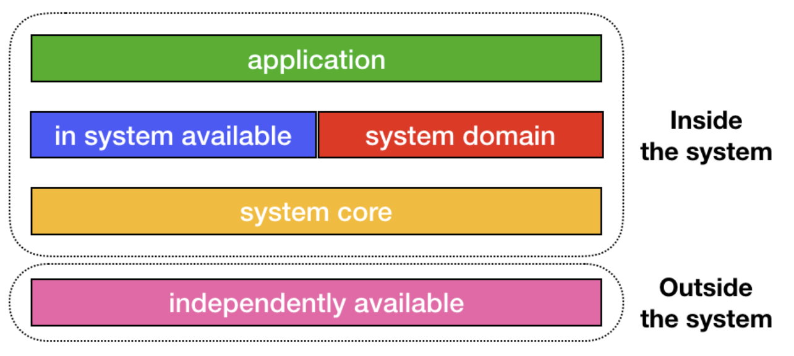

# 우아한 멀티모듈 - 2019년 8월 우아한 Tech 세미나

발표자 소개

* 배달의 민족에서 프론트 / 주문 / 결제 시스템 등을 담당해왔음
  * Hello World만 하고 발표를 하는게 아니라는것을 이야기드리고 싶었음
* 개인 사이드 프로젝트로 [코덕](https://co-duck.com/)을 하고 있음
* [블로그 내용](http://woowabros.github.io/study/2019/07/01/multi-module.html)을 기반으로 발표

## 1. 멀티 모듈

예시로 회원 시스템

* **단일** 모듈 **멀티** 프로젝트
  * 내부 API / 외부 API / 배치
  * 개별 프로젝트로 되어 있었음
  * 공용 클래스들은 **복사해서 각자 갖고 있음**
  * 사람에게 의존적인 일관성
* **단일** 모듈 **멀티** 프로젝트 + 메이븐 저장소
  * 3개의 개별 프로젝트 중 공용 클래스들은 내부 메이븐 저장소에 라이브러리 형태로 올려놓고 각자 프로젝트가 사용
  * 시스템으로 보장되는 일관성
  * 문제는 **번거로운 개발 사이클**
    * 하나만 수정해도 다음의 사이클이 필요
    * 메이븐에 업로드
    * 각 3개의 프로젝트가 메이븐 라이브러리 버전 Up & 다운로드
* **멀티** 모듈 **단일** 프로젝트
  * 시스템으로 보장되는 일관성
  * 빠른 개발 사이클

### 1-2. MSA? 멀티모듈?

* [블로그 글](http://woowabros.github.io/study/2019/07/01/multi-module.html) 쓰고나서 사람들 반응을 보니 MSA라는 말을 많이 하는 것을 발견
* MSA와 멀티 모듈은 다름
  * 멀티 모듈로 이루어진 마이크로 서비스가 있고, 이 서비스들 간에 구성되어 있는 형태가 MSA
* 모놀릭스는 멀티모듈을 못쓰나? -> No
  * 쓸 수 있음
* 멀티 모듈은 모놀릭스 <-> MSA 간 서로 전환하는 작업을 수월하게 할 수 있는 구조가 되도록 도와준다.

### 1-3. 실패한 멀티 모듈 프로젝트

* 멀티모듈? 공통 되는 코드를 제거할 수 있겠다!
* 공통 모듈을 만듬 - common
  * 3개 모듈에서 필요한 공통 코드 뿐만 아니라 **2개 모듈에서만 필요해도 common**에 넣는다.
  * 웬지 공통인 느낌이 들어도 common에 넣는다.
  * 그러다보니 시간이 지날수록 **common 모듈이 제일 큰 모듈**이 되어 있음
* 실패한 멀티 모듈 프로젝트
  * 스파게티 코드
    * 실제 겪었던 상황에서는 100~200개의 클래스가 서로 의존하고, 의존 역전하고 완전히 꼬여 있는 관계도 있었음
    * 이제 기능이 삭제되어야하는데, 이 기능을 구현한 클래스를 쓰는 다른 클래스들이 너무 많아서 롤백하기도 했음
    * 애초에 이런 코드가 있다는것 자체도 너무 스트레스 였음
  * 의존성 덩어리
    * common에서 Redis, DB, DynamoDB, AWS 등 **공통 인프라 의존성**을 다 가지고 있다보니 **애플리케이션 모듈들은 무조건 모든 인프라에 접근**하게 됨
  * 공통 설정
    * common 모듈에는 공통 config 클래스도 갖고 있었음
    * 근데 애플리케이션 모듈은 대부분 **적정 DB Connection Pool 이 다름**
    * 서비스 제공용 API는 100, 배치는 5, 내부 어드민용은 20~25정도면 되는데, 공통 config로 하다보니 모든 서비스가 최대치인 100을 갖고 있음
    * 이게 왜 문제냐면, 트래픽 대응을 위해 Scale Out을 하게 되면 DB Connection 수가 모잘라서 장애가 발생한다.
* 결국 이렇게 된 이유는 **모듈에 대한 정의가 모호했다**
  * 이름을 어떻게 짓느냐가 굉장히 중요한것 같다.
  * 그렇다면 모듈화란 무엇일까?
    * 무엇을 중심으로 정의를 내려야할까?
    * 객체지향과 마찬가지로 모듈도 **역할과 책임**을 기준으로
    * 그럼 역할과 책임에 대한 범위는?
      * 오픈소스들을 염탐
      * 스프링 프레임워크 등등
    * 계층이라는 것이 존재한다는 것을 발견
      * 계층/역할/책임/의존흐름이 규칙이 있었음
    * 근데 와닿지 않는 부분이 있음
      * 오픈소스 같이 비지니스에 비 종속적인 프로젝트를 하고 있지 않음
      * 내가 하고 있는 프로젝트는 비지니스, 즉 서비스를 제공하는 프로젝트라서 오픈소스와 같은 계층으로 둘수는 없다는것을 알게 됨
      * 내가 직접 계층과 역할을 나눠봐야겠다.

## 2. 멀티 모듈 구성하기

용어에 대해 모호할 수 있을것 같아서 미리 한번 정의하고 넘어가겠음

* 서비스
  * 독립적으로 실행 가능한 애플리케이션
* 시스템
  * 1개 이상의 서비스와 공유 인프라를 가진 것을 시스템
* 애플리케이션 로직
  * 요청 파라미터 검증, 메세징큐 데이터 요청 등등
* 도메인 로직
  * 실제 도메인이 처리하고 있는 로직



### 2-1. 내부 모듈 계층

* 내부 모듈
  * 시스템 안에서 의미를 갖고 있음
  * 어플리케이션 로직, 도메인 로직을 모름
* 외부 통신을 담당하는 모듈을 만들어 보자
  * 환경별 시스템 Host, Header 관리
  * 요청/응답 스펙 관리
  * 예외 처리 추상화 수준을 통일
* 여기서 내부 모듈과 독립 모듈의 차이는 **내부 모듈은 우리 비지니스를 벗어나면 의미가 없는 모듈**을 얘기한다.
* build.gradle
  * RestTemplate 등은 필요하니 spring-web만 필요하지 spring-starter-web이 필요하진 않는다
* Config 클래스
  * @ConditionalOnMissingBean 으로 사용하는 모듈측에서 언제든 Override 할 여지를 두게 한다.
* 이렇게 하면서 얻는 장점
  * 스펙 변경에 대한 단일 변경 포인트
  * 사용하는 곳을 추적

### 2-2. 도메인 모듈 계층

* 애플리케이션 로직을 모른다
* 하나의 모듈은 최대 하나의 인프라스트럭처에 대한 책임만 갖는다
* domain-rds
  * 인프라스트럭쳐 연동 관련
  * 도메인 계층 구현
* 도메인이 인프라를 알아야하나??
  * 인프라 교체가 발생할 일은 거의 없음
  * 인프라를 모르도록 도메인을 구축하게 되면 **수많은 인터페이스가 필요**하다
  * **어중간한 모듈화 보다는 중복이 낫다**
* build.gradle
* 도메인 개발은 우아한 객체지향 영상을 참고
* 다중 인프라스트럭처
  * DB가 여러개 or NoSQL이 추가로 있다면
  * 경험담) 다이나모DB의 데이터를 직접 조회하는데 성능이 안되 중간에 캐시를 위한 레디스를 두고 있음
    * 이럴때 코드는 어떻게 구성하면 좋을까?
    * 다이나모DB 와 레디스를 묶어놓으면 되겠지?
    * 이러면 장애발생율이 올라감
      * 실제로 레디스는 각 모듈이 필요하면 쓰고 아니면 안써도 되는 계층
    * domain-redis, domain-dynamo 모듈을 개별적으로 관리
      * 둘은 서로를 모름
      * 이 둘을 어떻게 조립할지는 **각 애플리케이션 모듈이 판단**한다.
      * 필요하면 **domain-service**를 둘 수는 있음

### 2-3. 독립 모듈 계층

* 똑 떼서 오픈소스로 낼 수 있는 계층
* 그 어떤 시스템도 의존하진 않음

### 2-4. 공통 모듈 계층

* Type, Util 등을 정의
* 대신 제약 조건을 둔다
  * Java를 사용하는 것 외에 **절대 의존성을 두지 않는다**
  * 즉, Apache Commons 등 절대 가지지 않음
  * build.gradle
* 경험담)
  * 시간 관련 유틸이 필요했음

### 2-5. 애플리케이션 모듈 계층

* 위에서 나열된 모듈들은 비지니스에 맞게 조립하는 역할

### 2-6. 효과

* 명확한 추상화 경계
  * 각 모듈이 갖는 책임과 역할이 명확해 리팩토링, 기능 변경 영향 파악하기가 쉬워짐
  * 스파게티 코드 발생 가능성 저하
    * 없앴다고 할 순 없음
  * 역할과 책임에 대한 애매함이 없어져 어떤 모듈에서 어느 정도 까지를 개발되야할지 명확
* 최소 의존성
  * 애플리케이션 모듈에서 조립하기 전까지는 최소한의 모듈들이 존재
  * 애플리케이션은 필요한 모듈만 선택한다.

### 2.7 꿀팁

* 모듈 Scan
  * 패키지 컨벤션
  * 마지막 패키지 아래에 ```@SpringBootApplication```이 있으면 **해달 모듈만 스캔**하게 됨
  * 그래서 ```@Import```, ```@EntityScan``` 등이 자꾸 추가 됨
  * 한단계 위에 ```@SpringBootApplication```를 두면 스캔 대상에 하위 모듈이 모두 포함되게 됨
* 각 모듈의 Property
  * 모듈들의 yml을 모두 자동으로 scan 하도록 구성
  * [spring-boot-custom-yaml-importer](https://github.com/kingbbode/spring-boot-custom-yaml-importer)
* 의존성 숨기기
  * compile vs implementation
  * compile 은 common 모듈이 갖고 있는 의존성도 사용중인 애플리케이션 모듈이 다 쓸 수 있음
  * implementation 은 의존성의 의존성을 사용할 수가 없음
    * 계층을 넘어가서 의존성을 사용할수가 없음

